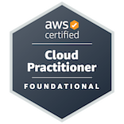
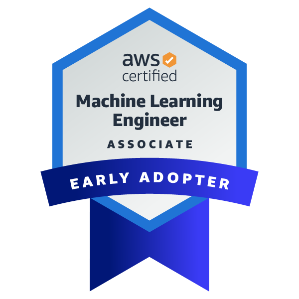

## Hello there, I'm Freeman  \ ゜◡゜)ノ

I'm an individual game developer and created 30+ games; however, only a few of them are finished.😢
~Then I become a web dev~

### 🔮 About me
<!-- - 🔭 I’m currently working on my second website. -->
- 🌱 I’m currently working on a business site.
- ⚡ I'm not good at gaming SO I do game development~
- ⏲️ I have over 8 years of experience in game development and over a year of web development.

### 📬 Connect with me
```text
 ∧,,,∧   ~ ┏━━━━━━━━━━━━━━━━━━━┓
( ̳•·• ̳)   ~ ゜  Nothing's here  ゜
/    づ    ~ ┗━━━━━━━━━━━━━━━━━━━┛
```

### 💖 Donation

[](https://github.com/soranoo/Donation) <- ღゝ◡╹)ノ♡

<br>

### 🔥 MY Stats

<div style="display:flex;justify-content:left; gap:10px;">

  
  

</div>


---

### 🔍 What I know

#### Languages
[](https://github.com/soranoo)

#### Frameworks
[](https://github.com/soranoo)
 
#### Databases
[](https://github.com/soranoo)

#### Tools

[](https://github.com/soranoo)

#### Platforms

[](https://github.com/soranoo)

---

### 🎖️ Certification

[](https://github.com/soranoo)
[](https://github.com/soranoo)
[](https://github.com/soranoo)

---

### 📌 Last Words

```text
∩―――――――――――――∩
||     ∧ ﾍ　 ||
||    (* ´ ｰ`) ZZzz
|ﾉ^⌒⌒づ`￣￣  ＼
(　ノ　　   ⌒ ヽ ＼
＼　　||￣￣￣￣￣||
　＼,ﾉ||

Take your time and have a good sleep!

|￣￣￣￣￣￣￣￣￣￣￣￣￣￣|
| Thank you for visiting!  |
|＿＿＿＿＿＿＿＿＿＿＿＿＿＿|
         \ (•◡•) /
          \     /
            END
```


